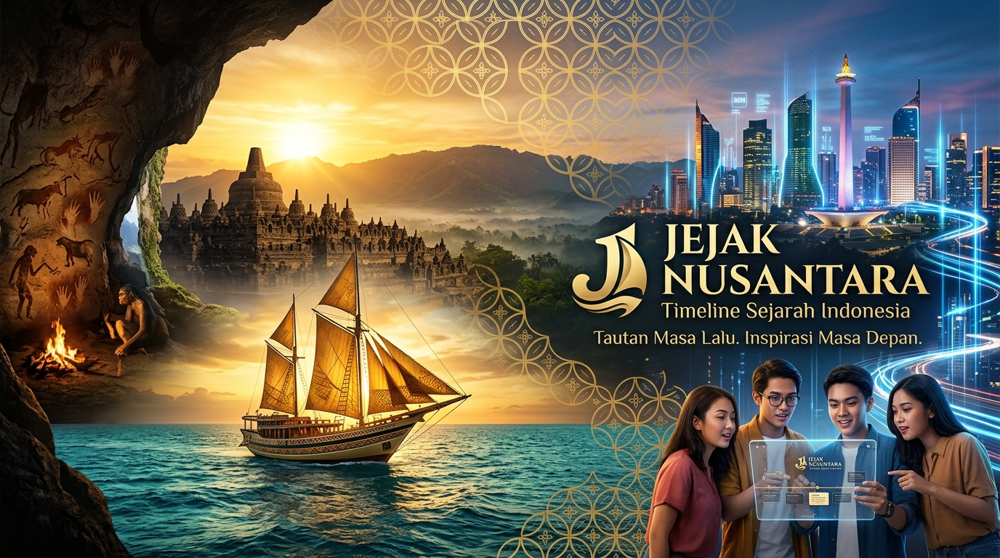

<div align="center">

  

  <br /><br />

  # 🇮🇩 JEJAK NUSANTARA
  ### *Interactive Historical Timeline & Cultural Web Experience*

  [](https://developer.mozilla.org/en-US/docs/Web/HTML)
  [](https://developer.mozilla.org/en-US/docs/Web/CSS)
  [](https://developer.mozilla.org/en-US/docs/Web/JavaScript)
  [](https://www.w3.org/TR/SVG2/)
  [](https://dhany-el.github.io/jejak-nusantara/)

  <br />

  <p align="center">
    <b>Menyusuri ±2 Juta Tahun Perjalanan Sejarah &amp; Peradaban Indonesia</b><br />
    <i>Dari Fosil Manusia Purba Sangiran hingga Pembangunan Ibu Kota Nusantara (IKN)</i>
  </p>

  <br />

  [🌐 Buka Live Application](https://dhany-el.github.io/jejak-nusantara/) •
  [🗺️ Peta Linimasa Sejarah](#%EF%B8%8F-peta-visual-linimasa-sejarah) •
  [📚 Indeks 6 Babak](#-indeks-kronologi-6-babak) •
  [✨ Visual &amp; Fitur Canggih](#-fitur-visual--teknologi-canggih)

  <br />

</div>

---

> [!NOTE]
> **Showcase Portofolio Web Development**: *Jejak Nusantara* dibangun secara murni (*Zero Dependency / Pure Vanilla Web*) tanpa menggunakan *framework* atau *library* luar. Seluruh visualisasi, ilustrasi vektor SVG, kalkulasi linimasa logaritmik, dan tata letak responsif dikemas mandiri dalam performa terbaik.

---

## 🗺️ Peta Visual Linimasa Sejarah

```
┌─────────────────────────────────────────────────────────────────────────────────────────┐
│                                  JEJAK NUSANTARA                                        │
│                 ±2.000.000 Tahun Lalu ──► Abad ke-4 M ──► Masa Kini (2026)               │
└─────────────────────────────────────────────────────────────────────────────────────────┘
       │
       ├── 🏛️ BABAK I: PRASEJARAH (±2.000.000 SM – 500 SM)
       │    ├── 01. Meganthropus & Pithecanthropus Soloensis
       │    ├── 02. Homo Floresiensis ("Manusia Liang Bua")
       │    ├── 03. Gelombang Migrasi Bangsa Austronesia
       │    ├── 04. Zaman Berburu-Meramu & Lukisan Cadas Maros
       │    └── 05. Revolusi Neolitikum & Punden Berundak
       │
       ├── 🕉️ BABAK II: ZAMAN HINDU-BUDDHA (Abad 4 M – 16 M)
       │    ├── 06. Kerajaan Kutai Martapura (Prasasti Yupa)
       │    ├── 07. Kerajaan Tarumanegara & Purnawarman
       │    ├── ✦. Kerajaan Kalingga & Ratu Shima
       │    ├── 08. Kemaharajaan Maritim Sriwijaya
       │    ├── 09. Mataram Kuno (Borobudur & Prambanan)
       │    ├── ✦. Kerajaan Kediri & Sastra Jawa Kuno
       │    ├── ✦. Kerajaan Singhasari & Ken Arok
       │    └── 10. Kerajaan Majapahit & Sumpah Palapa
       │
       ├── 🌙 BABAK III: ISLAM & KESULTANAN (Abad 7 M – 18 M)
       │    ├── 11. Penyebaran Islam & Peran Wali Songo
       │    ├── ✦. Kerajaan Bali Gelgel (Pelestari Budaya)
       │    ├── 12. Kesultanan Demak & Fatahillah
       │    ├── ✦. Kesultanan Banjar & Tradisi Sungai
       │    ├── 13. Kesultanan Aceh Darussalam & Utsmaniyah
       │    ├── 14. Kesultanan Mataram Islam & Kalender Jawa
       │    └── 15. Gowa-Tallo & Ternate-Tidore (Jalur Rempah)
       │
       ├── 🏰 BABAK IV: ZAMAN KOLONIAL (1509 – 1945)
       │    ├── 16. Kedatangan Bangsa Eropa & Monopoli VOC
       │    ├── 17. Hindia Belanda & Sistem Tanam Paksa
       │    ├── 18. Perlawanan Rakyat (Diponegoro, Padri, Pattimura)
       │    └── 19. Politik Etis & Pendudukan Jepang
       │
       ├── 🇮🇩 BABAK V: PERGERAKAN & KEMERDEKAAN (1908 – 1949)
       │    ├── 20. Era Kebangkitan Nasional (Budi Utomo)
       │    ├── 21. Ikrar Sumpah Pemuda (28 Oktober 1928)
       │    ├── ✦. Kongres Perempuan Indonesia (22 Des 1928)
       │    ├── 22. Proklamasi Kemerdekaan 17 Agustus 1945
       │    └── 23. Perjuangan Revolusi Fisik & Diplomasi
       │
       └── 🕊️ BABAK VI: INDONESIA MERDEKA (1945 – Masa Kini)
            ├── 24. Era Orde Lama & Konferensi Asia-Afrika
            ├── ✦. Konfrontasi Indonesia-Malaysia
            ├── 25. Era Orde Baru & Pembangunan Ekonomi
            ├── 26. Era Reformasi & Demokrasi Multipartai
            ├── ✦. Integrasi & Referendum Timor Timur
            ├── ✦. Tragedi Bom Bali & Kontraterorisme
            ├── ✦. Penanganan Pandemi COVID-19
            ├── ✦. Pemindahan Ibu Kota Nusantara (IKN)
            └── 27. Indonesia Hari Ini (Demokrasi & Digital)
```

---

## 📚 Indeks Kronologi 6 Babak

| Babak | Periode Waktu | Jumlah Titik | Kejadian & Tokoh Kunci | Deep Link |
| :--- | :--- | :---: | :--- | :---: |
| **Babak I — Prasejarah** | ±2.000.000 SM – 500 SM | 5 Titik | Sangiran, Homo Floresiensis, Austronesia, Lukisan Gua Maros | [`#era-1`](https://dhany-el.github.io/jejak-nusantara/#era-1) |
| **Babak II — Hindu-Buddha** | Abad ke-4 M – 16 M | 8 Titik | Kutai, Tarumanegara, Kalingga, Sriwijaya, Borobudur, Majapahit | [`#era-6`](https://dhany-el.github.io/jejak-nusantara/#era-6) |
| **Babak III — Islam & Kesultanan** | Abad ke-7 M – 18 M | 7 Titik | Wali Songo, Demak, Aceh Darussalam, Mataram Islam, Gowa-Tallo | [`#era-11`](https://dhany-el.github.io/jejak-nusantara/#era-11) |
| **Babak IV — Zaman Kolonial** | 1509 – 1945 | 4 Titik | Monopoli VOC, Tanam Paksa, Perang Diponegoro, Pendudukan Jepang | [`#era-16`](https://dhany-el.github.io/jejak-nusantara/#era-16) |
| **Babak V — Pergerakan & Kemerdekaan** | 1908 – 1949 | 5 Titik | Budi Utomo, Sumpah Pemuda, Proklamasi 1945, Revolusi Fisik | [`#era-20`](https://dhany-el.github.io/jejak-nusantara/#era-20) |
| **Babak VI — Indonesia Merdeka** | 1945 – Masa Kini | 9 Titik | KAA 1955, Orde Baru, Reformasi 1998, Pandemi, IKN Nusantara | [`#era-24`](https://dhany-el.github.io/jejak-nusantara/#era-24) |

---

## ✨ Fitur Visual & Teknologi Canggih

> [!TIP]
> **Interaktivitas Tanpa Framework**: Aplikasi ini memanfaatkan API peramban asli (*Native Web API*) seperti `IntersectionObserver`, `requestAnimationFrame`, `window.matchMedia`, dan kalkulasi Matematika logaritmik secara langsung.

### ⏱️ 1. HUD Dial Meter & Logarithmic Year Interpolation
* **Circular Progress Gauge**: Meteran SVG melingkar yang melacak persentase pengguliran halaman secara presisi.
* **Continuous Year Reader**: Algoritma kalkulasi logaritmik ($y = f(x)$) yang mengestimasi tahun secara kontinu dari 2.000.000 SM hingga masa kini saat halaman digulir.

### 🖼️ 2. 3D Parallax & Frame Tilt Interaction
* **3D Perspective Tilt**: Efek kemiringan bingkai ilustrasi SVG yang merespons posisi kursor mouse secara interaktif.
* **Smooth Animation Layering**: Kombinasi `perspective(700px)`, `rotateX()`, dan `rotateY()` dengan transisi *spring-cubic-bezier*.

### 🎨 3. Inline Vector SVG Art & Batik Pattern System
* **Motif Batik Vektor**: Pembatas babak bermotif khas Indonesia (*Batik Kawung* & *Batik Parang*) menggunakan SVG `<pattern>`.
* **Ambient Floating Particles**: Efek partikel emas yang melayang lembut dengan CSS `@keyframes drift`.

### ✦ 4. Interactive Accordion ("Fakta Menarik")
* **Expand-in-Place Fact List**: Setiap titik sejarah dilengkapi panel accordion interaktif yang membuka fakta-fakta historis mendalam tanpa mengganggu alur linimasa.

---

## 🛠️ Arsitektur Proyek

```
jejak-nusantara/
├── index.html              # Berkas Utama Mandiri (HTML5 + CSS3 + Inline SVG + ES6 JS)
├── banner.jpg              # Hero Graphic Visual Banner untuk GitHub Repository
├── package.json            # NPM & Script Config
├── vite.config.js          # Pengaturan Server & Preview
├── README.md               # Dokumentasi Visual Portofolio
└── dist/                   # Production Build
    └── index.html
```

---

## 👨‍💻 Profil Pengembang

<div align="center">

  ### **Dhany (`@dhany-el`)**
  *Front-End Web Developer*

  [](https://github.com/dhany-el)
  [](https://dhany-el.github.io/jejak-nusantara/)

  *Dibuat dengan rasa bangga untuk memperkenalkan kekayaan sejarah dan kebudayaan Indonesia melalui karya aplikasi web modern.*

</div>

---

<div align="center">
  <sub>Lisensi MIT © 2026 Dhany (@dhany-el). Hak Cipta Dilindungi.</sub>
</div>
